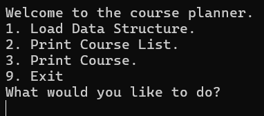
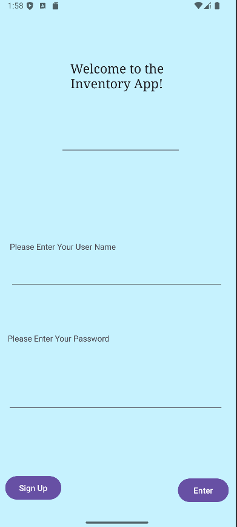

<picture>
  <source media="(prefers-color-scheme: dark)" srcset="IntroMe.png">
  <source media="(prefers-color-scheme: light)" srcset="IntroMe.png">
  
</picture>

# Greetings and Salutations!
My name is Kristie O'Brien and it is my honor to have you visit this site! Here you will find what has been my final work in my Bachelor Degree
of Computer Science at Southern New Hampshire University, or what we students affectionately call our alma mater, SNHU. Over the course of my time here at SNHU, I have obtained two degrees, one in Mathematics and the other in Computer Science.

# Code Review
First things first, it is hard to enhance a coding artifact without first knowing where you stand with the existing code. In the following video, you can see my play by play walkthrough of hte three existing coding projects as they were when I turned them in as final projects for various classes throughout my Computer Science program. In this video I go over the following key criteria to evaluate how well the existing artifacts function and meet modern computer science standards.
* Structure
* Documentation
* Variables
* Arithmetic Operations
* Loops and Branches
* Defensive Programming

<iframe width="560" height="315" src="https://www.youtube.com/embed/x3H3RENZxw8?si=XqqlE4ZE6HTEMiIP" title="YouTube video player" frameborder="0" allow="accelerometer; autoplay; clipboard-write; encrypted-media; gyroscope; picture-in-picture; web-share" referrerpolicy="strict-origin-when-cross-origin" allowfullscreen></iframe>

# Software Engineering

# Algorithms and Data Structures

# Databases
<a href="https://github.com/KO-SNHU/KO-SNHU.github.io/tree/main/InventoryAndroidApp/EnhancedInventoryApp" target="_blank">
    
  <figcaption>Click this Picture for the Enhanced Inventory App!</figcaption>
</a>

# Hello World!
<picture>
  <source media="(prefers-color-scheme: dark)" srcset="https://github.com/KO-SNHU/KO-SNHU.github.io/blob/main/IntroMe.png">
  <source media="(prefers-color-scheme: light)" srcset="https://github.com/KO-SNHU/KO-SNHU.github.io/blob/main/IntroMe.png">
  
</picture>

